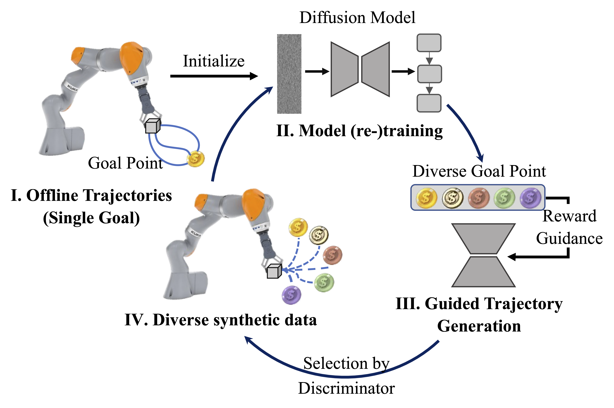

# AdaptDiffuser for KUKA

### [Project Page](https://adaptdiffuser.github.io/) | [Paper](https://arxiv.org/abs/2302.01877)

This is the official PyTorch implementation of paper:

> ### [AdaptDiffuser: Diffusion Models as Adaptive Self-evolving Planners](https://arxiv.org/abs/2302.01877)
> Zhixuan Liang, Yao Mu, Mingyu Ding, Fei Ni, Masayoshi Tomizuka, Ping Luo
> 
> ICML 2023 (Oral Presentation)



## Preparation

### Environment
Code is tested on `CUDA 11.1` with `torch 1.9.1`

You should install [mujoco200](https://www.roboti.us/download.html) first and get your licence [here](https://www.roboti.us/license.html).
```shell
conda env create -f environment.yml
conda activate diffuser_kuka
pip install -e .
```

Specify the project root path.
```shell
export ADAPTDIFF_ROOT=$(pwd)
```

### Dataset
Download and extract the checkpoint of guided model and dataset for model pretraining from this [URL](https://www.dropbox.com/s/zofqvtkwpmp4v44/metainfo.tar.gz?dl=0) and save it as the following path 
```shell
tar -xzvf metainfo.tar.gz

ln -s metainfo/kuka_dataset ${ADAPTDIFF_ROOT}/kuka_dataset
ln -s metainfo/logs ${ADAPTDIFF_ROOT}/logs
```

## Train the original KUKA stacking task (Seen Task)
This part is equal to [diffuser](https://github.com/jannerm/diffuser/tree/kuka) repo. 
To train the unconditional diffusion model on the block stacking task, you can use the following command:

```
python scripts/kuka.py --suffix <suffix>
```
Model checkpoints are saved in "logs/multiple_cube_kuka_{suffix}_conv_new_real2_128".

You may evaluate the diffusion model on unconditional stacking with

```
python scripts/unconditional_kuka_planning_eval.py
```

or conditional stacking with

```
python scripts/conditional_kuka_planning_eval.py
```

Generated samples and videos will be logged to `./results` periodically.

## Guided Trajectory Generation and Selection
With the trained kuka model, you can generate KUKA Stacking data (bootstrapping) or KUKA Pick and Place data (adaptation).
### Generate KUKA Stacking data
```shell
python scripts/conditional_kuka_planning_eval.py --env_name 'multiple_cube_kuka_temporal_convnew_real2_128' --diffusion_epoch 650 --save_render --do_generate --suffix ${SAVE_DIR_SUFFIX} --eval_times 1000

# You can specify the directory name to save data with --suffix
```

You can set a different dataset by specifying `--data_path`.

### Generate KUKA Pick and Place data
```shell
python scripts/pick_kuka_planning_eval.py --env_name 'multiple_cube_kuka_temporal_convnew_real2_128' --diffusion_epoch 650 --save_render --do_generate --suffix ${SAVE_DIR_SUFFIX} --eval_times 1000

# You can specify the directory name to save data with --suffix
```

Data generated path is: 'logs/{env_name}/plans_weighted5.0_128_1000/{suffix}/gen_dataset'

*Note: There are directories under {suffix} directory, one is "cond_samples" which contains all the generated data and the other is "gen_dataset" which contains the selected high-quality data. We use "gen_dataset" to fine tune opur model.*

## Model Re-training
### Fine-tune the model with generated pick and place data (Unseen Task)
For example, you set your generated data to `./pick2put_dataset/gen_0`
```shell
python scripts/kuka_fine.py --data_path "./pick2put_dataset/gen_0" --suffix adapt1 --train_step 401000 --pretrain_path <pretrain_diffusion_ckpt> --visualization

# set visualization True only when you can have a graphicX, unset visualization will not affect the result
```
Model checkpoints are saved in 'logs/multiple_cube_kuka_pick_conv_new_real2_128/{suffix}'

## Evaluation
### Evaluate on KUKA Stacking Task
You can still test the bootstrapping performance of AdaptDiffuser on unconditional stacking with

```
python scripts/unconditional_kuka_planning_eval.py --env_name <fine_tuned_model_dir>
```

or conditional stacking with

```
python scripts/conditional_kuka_planning_eval.py --env_name <fine_tuned_model_dir>
```

### Evaluate on KUKA Pick and Place Task

```
python scripts/pick_kuka_planning_eval.py --env_name <fine_tuned_model_dir>
```

Besides, you could specify the `env_name` to pretrained [diffuser](https://github.com/jannerm/diffuser)'s diffusion model to derive its performance on KUKA Pick and Place Task.

## Citation
If you find this code useful for your research, please use the following BibTeX entry.
```bibtex
@inproceedings{liang2023adaptdiffuser,
    title={AdaptDiffuser: Diffusion Models as Adaptive Self-evolving Planners},
    author={Zhixuan Liang and Yao Mu and Mingyu Ding and Fei Ni and Masayoshi Tomizuka and Ping Luo},
    booktitle = {International Conference on Machine Learning},
    year={2023},
}
```

## Acknowledgements

The diffusion model implementation is based on Michael Janner's [diffuser](https://github.com/jannerm/diffuser) repo.
The organization of this repo and remote launcher is based on the [trajectory-transformer](https://github.com/jannerm/trajectory-transformer) repo. 
We thank the authors for their great works! Also, extend my great thanks to members of [MMLAB-HKU](http://luoping.me/#about). 

